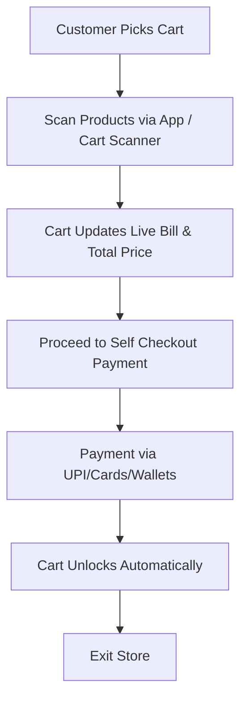

# 🛒 SmartCart – Next-Gen Retail Checkout Solution

[](https://nodejs.org/)
[](https://react.dev/)
[](https://www.mongodb.com/)
[](LICENSE)

---

## 📌 Overview

**SmartCart** is a revolutionary **hardware + software solution** designed to eliminate long checkout queues in supermarkets, hypermarkets, and retail malls.  
It combines **smart carts** with an integrated **mobile application** and **self-checkout system** to save customers' time and increase store efficiency.

---

## 🚀 Problem Statement

In large retail stores like Vishal Mart, Reliance Mart, or V-Mart, customers often face:

- Long queues at billing counters 🕒
- Time wastage even for small purchases ⏳
- Frustration, leading customers to leave without buying 😓
- Store congestion during peak hours 🛍️

---

## 💡 Solution

**SmartCart** solves this by:

- Providing **self-checkout carts** equipped with product scanning & payment options
- Integrating a **mobile app** for scanning items as you shop
- Enabling **instant payment** via UPI, cards, or digital wallets
- Automatically unlocking the cart once payment is complete
- Syncing directly with the store's **POS & inventory system**

---

## 📊 How It Works – Workflow


🏗️ Tech Stack

```
| Technology                 | Purpose                |
| -------------------------- | ---------------------- |
| **React.js**               | Frontend (Web/App)     |
| **Node.js + Express.js**   | Backend API            |
| **MongoDB**                | Database               |
| **Cloudinary**             | Product Image Storage  |
| **RFID / Barcode Scanner** | Product Identification |
| **Raspberry Pi / Arduino** | Cart Hardware Control  |
| **UPI / Razorpay API**     | Payment Gateway        |
```

## 📱 Features
```
✅ Real-Time Price Updates
✅ Seamless UPI / Card Payments
✅ Cart Lock/Unlock Security
✅ Store Inventory Sync
✅ Multi-Customer Parallel Checkout
✅ Data Analytics for Stores
```

## 📈 Business Impact
```
For Customers: Faster checkout, zero queue time, better shopping experience

For Stores: Reduced cashier workload, better customer retention, advanced analytics
```

## ⚠️ Challenges
Initial hardware manufacturing cost

Customer learning curve for first-time users

## 🏆 Author
👤 Prince Bhatt

💼 Full Stack Web Developer

📧 Email: princebhatt316@gmail.com

🌐 Portfolio: [Link](https://princebhatt03.github.io/Portfolio/)

## 🔮 Future Implementations
AI-based product recommendations

Voice-assisted shopping guide

Home delivery integration

Multi-language support

NFC-based quick scanning

## 📜 License
This project is licensed under the MIT License - see the LICENSE file for details.
